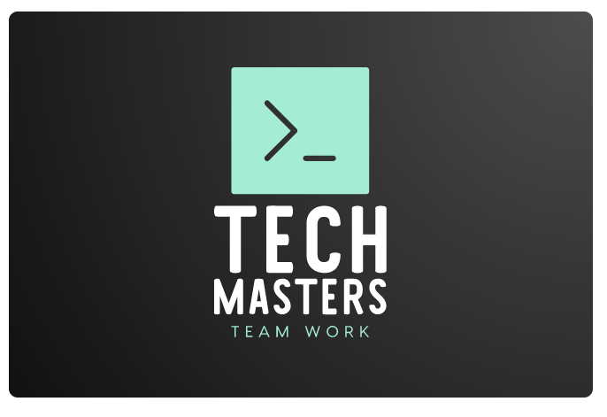
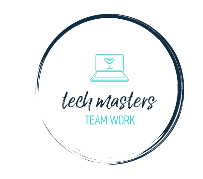

# TECH MASTERS
PROJECT MASTERS* As being in a student community, 
we are looking to solve the issues relating to effective communication between students.  
which will include forming classes on social app, looking for sellers, negotiating prices and a lot more... The aim is to work on a project that encompasses a lot of features. 

***

# About Project
*FEATURES TO BE INCLUDED IN THE PROJECT
1. Messaging App (Social Profile)
2. Connecting with campus sellers (Marketplace)
3. Escrow Payments Structure (Finance Aspect)   
4. Library Function (For students to get materials) NOTE:  this is just going to be an addon page
5. Routing and Rerouting System (Logistics)
***
<br>


# Getting started

## 1. *MESSAGING APP(SOCIAL PROFILE)*

> Just like every other social profiles, this will be like a messaging profile where students can connect with one another on campus, talk to one another and create groups.

## 2. *CONNECTING WITH SELLERS(MARKETPLACE)*

> This may seem like an e-commerce buh it is not. It's more like a multi-vendor e-commerce. Different sellers can set up their profiles online with their own pages and they can create profile on the web app as a seller and student (nonetheless, their products will be limited to categories).

> This is an initiative to solve the issue of posting needlessly and tirelessly on WhatsApp groups or sfuff.. through this, they get to meet with different buyers and lot.


***

# 3. *ESCROW PAYMENTS STRUCTURE(FINANCE)*

    This has to do with how payments for products are being made.

> For the purpose of fairness.

***

# 4. *LIBRARY FUNCTION*

 * This is just an addon page.
```
Instead of adding blog
```
>we will add this in the project... Students from all departments can make use of this function to search materials online, or books saved locally. That is, this function will be connected to both online and books saved locally. 
 


***

# 5. *ROUTING AND REROUTING SYSTEM(LOGISTICS)*
>This for now will be focused on predicting time of delivery since it's focused on school community. Nonetheless, we can include the traffics prediction for the purpose of the project.
    
***

#  license

```
    ---------------------------------------------------
                      TECH MASTERS PROJECT                                                
    ---------------------------------------------------
        Copyright (C) <2023>(TECH MASRERS)
                UNIVERSITY OF ILORIN
This program is free software: you can redistribute it and/or modify
it under the terms of the TECH MASTERS GROUP 

This program is distributed in the hope that it will be useful, FOR THE GENERAL PUBLIC.


```
<br>


# CONTACT US FOR UPDATE PERMISSION IN ANY OF THE EMAILS BELOW
<br>

<a href="mailto:okunabd@gmailcom">okunabd@gmail.com</a><br>
        <a href="mailto:nafees.rayyan@gmail.com ">nafees.rayyan@gmail.com </a><br>
        <a href="mailto:bljazeem@gmail.com">bljazeem@gmail.com</a><br>
        <a href="mailto:olaniyanridwan000@gmail.com">olaniyanridwan000@gmail.com</a><br>
        <a href="mailto:nelsonamstrong15@gmail.com">nelsonamstrong15@gmail.com</a><br>
        <a href="mailto:Ayorinde5020@gmail.com">Ayorinde5020@gmail.com</a><br>
        <a href="mailto:Yusufridwanayomidejamb@gmail.com">Yusufridwanayomidejamb@gmail.com</a><br>
        <a href="mailto:shukuraheniola620@gmail.com">shukuraheniola620@gmail.com</a><br>
        <a href="mailto:adebusolaemmanuel@gmail.com"> adebusolaemmanuel@gmail.com </a><br>
        <a href="mailto:akandeolalekantoheeb94@gmail.com">akandeolalekantoheeb94@gmail.com</a><br>
# ROUTING-REROUTING-SYSTEM
